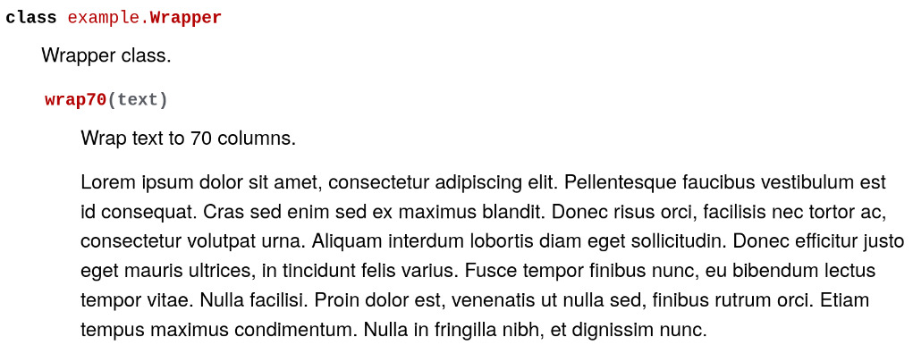

# Sphinxrun

Prototype for a sphinx extension which executes code and inserts the generated content in a sphinx documentation.

Example:

```py
class Demo:
    """Demo class.

    The setup code is executed before all run codes for the current document.

    .. runsetup::

        import sphinxrun
        from docutils import nodes
    """

    def a(self):
        """a method

        Explicitly export a node to insert in the document.

        .. run::

            sphinxrun.show(nodes.paragraph(text='hello world from A.a()!'))
        """
        return "A.a return value"

    def b(self):
        """b method

        Alternatively, write rst markup to stdout.

        .. run::

            print(r'''Hello world from `A.b()`!

            .. note::
                This is a printed note.
            ''')
        """
        return 1
```

Renders like this:

